# harmony-book

Stack e strumenti per la scrittura di un libro di armonia occidentale, portabile tra Windows 11 e
Linux. Questo repository pubblico contiene il *metodo* (configurazione tipografica, build, sistema di
contesto), non il contenuto del libro: i capitoli sono privati e non vengono versionati qui (vedi
"Modello di privacy del contenuto").

## Stack

La composizione usa LaTeX con engine LuaLaTeX (Unicode nativo, font OpenType via `fontspec`,
microtipografia completa con `microtype`), classe `memoir`, e gli esempi musicali sono prodotti con
LilyPond integrato attraverso il preprocessore `lilypond-book`. La bibliografia e' gestita con
`biblatex` + `biber`, l'indice con `imakeidx`, il glossario con `glossaries`. L'ambiente TeX e'
TinyTeX user-local, descritto in modo riproducibile dal manifesto `tex-packages.txt`; LilyPond e' un
binario esterno da installare a parte. Il razionale completo e le alternative scartate sono in
`.claude/context/STACK.md`.

## Struttura

```
harmony-book/
  style/            preambolo condiviso e macro armoniche (pubblico)
    preamble.tex
    harmony-macros.sty
  sample/           documento minimo per verificare la catena (pubblico)
    main.lytex
    references.bib
    music/cadenza-demo.ly
  scripts/          setup e build per Windows (.ps1) e Unix (.sh)
  tex-packages.txt  manifesto dei pacchetti TeX (TinyTeX)
  .latexmkrc        engine LuaLaTeX
  manuscript/       CONTENUTO del libro (privato, ignorato da git)
  build/            output di compilazione (ignorato da git)
  .claude/          sistema di contesto, documentazione e version control
```

## Come compilare

Prima volta, per preparare l'ambiente (scarica TinyTeX e i pacchetti; LilyPond va installato a parte
e messo sul PATH):

```
# Windows
powershell -ExecutionPolicy Bypass -File scripts\setup-tex.ps1
# Linux/macOS
sh scripts/setup-tex.sh
```

Compilazione (usa `manuscript/main.lytex` se presente, altrimenti `sample/main.lytex`):

```
# Windows
powershell -ExecutionPolicy Bypass -File scripts\build.ps1
# Linux/macOS
sh scripts/build.sh
```

Il PDF esce in `build/`. La procedura e' incapsulata nella skill `latex-build`
(`.claude/skills/latex-build/SKILL.md`).

## Diagrammi del flusso di lavoro



Ciclo quotidiano: scrivere in `manuscript/`, compilare, rivedere il PDF e, al traguardo, committare
e ri-ancorare con `sync-context`.



Cosa è pubblico (metodo e struttura) e cosa resta privato e locale (il contenuto del libro).



Come `build.ps1` produce il PDF: `lilypond-book`, LuaLaTeX, `biber`, `makeindex`, `makeglossaries`.

I sorgenti `.mmd` stanno accanto agli `.svg` in `.claude/context/diagrams/`; per rigenerarli dopo
una modifica: `node tools/render-diagrams.mjs`.

## Modello di privacy del contenuto

Il contenuto vendibile del libro non deve mai essere pubblicato. La cartella `manuscript/` (capitoli,
esempi musicali, bibliografia reale) e' percio' ignorata da git e non finisce in questo repository
pubblico; il backup della prosa avviene a parte (copia locale da SSD a SSD). `manuscript/` e' un
sottoalbero autonomo: se in futuro serve versionarlo, basta inizializzare un repository git privato
al suo interno, senza ristrutturare nulla. Il version control pubblico tiene quindi traccia
dell'avanzamento di *struttura e metodo*, non del testo.

## Risorse e riferimenti

Notazione musicale con LilyPond e integrazione in LaTeX:

- LilyPond, sito e download: https://lilypond.org/
- LilyPond, uso con LaTeX (`lilypond-book`): https://lilypond.org/doc/stable/Documentation/usage/latex
- TeX FAQ, comporre musica in LaTeX: https://texfaq.org/FAQ-music
- Guida di riferimento "LaTeX for Musicians" (LilyPond + LaTeX), cap. 4 sull'integrazione.

Editoria e autopubblicazione con LaTeX:

- Pubblicare un libro con LaTeX (tutorial): https://tex.stackexchange.com/questions/644
- Usare LaTeX con gli editori: https://writing.stackexchange.com/questions/9875
- Modelli di libro in LaTeX: https://www.latextemplates.com/cat/books
- Impostare un documento per l'autopubblicazione: https://tex.stackexchange.com/questions/19497
- "Better Books with LaTeX, the Agile Way": https://leanpub.com/betterbookswithlatextheagileway
- Esperienza di autopubblicazione open source: https://hmemcpy.com/2020/02/everything-i-learned-about-self-publishing-an-open-source-book/

## Note

Le operazioni git (`add`, `commit`, `push`) sono manuali. L'identita' git e il remoto sono
configurati a livello locale del repository secondo `.claude/rules/git-identity-and-repo.md`.
